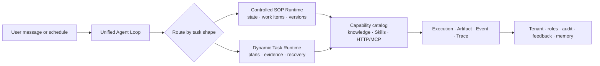

# Gongge Xuban

<p align="center">
  
</p>

<p align="center">
  <strong>Enterprise AI that follows the process—and finishes the work</strong><br />
  A platform for building, running, and governing digital employees
</p>

<p align="center">
  <strong>Controlled where it matters · Dynamic by default</strong>
</p>

<p align="center">
  
  
  
  
  
</p>

<p align="center">
  <a href="README.md">中文</a> · English
</p>

Gongge Xuban combines role knowledge, SOPs, approvals, tools, and reusable Skills into executable and governable organizational capabilities. A user can start from chat or a scheduled trigger; the platform chooses a suitable execution mode and preserves the execution, evidence, human decisions, and result.

## The core idea

Enterprise work has two complementary shapes:

- **Controlled SOPs** for stable steps, clear responsibility, approvals, and business records.
- **Dynamic tasks** for open-ended goals that require research, file analysis, method selection, and deliverables.

When a task combines both, the SOP remains the authority for process and responsibility while Skills, knowledge, and bounded dynamic work handle analysis sub-tasks. Both modes use the same Agent Loop, capability catalog, execution governance, and tenant boundaries.

## Two execution modes

| Mode | What it solves | How it runs | Example work |
| --- | --- | --- | --- |
| **Controlled SOP** | Turns stable business rules into repeatable processes | A versioned state machine collects inputs, branches on conditions, and pauses for confirmation, work items, approvals, or external events | Leave, expense, access, seal, HR certificates, IT tickets, contract review |
| **Dynamic task** | Turns an open goal into bounded multi-step work | A normalized plan combines authorized knowledge, Skills, tools, attachments, and artifacts; it pauses and resumes when human input or authorization is needed | Document comparison, research, data synthesis, diagnosis, structured writing |

SOPs model nodes, slots, conditions, confirmations, human work items, retries, timeouts, idempotency, and audit events. Dynamic tasks start from a goal and success criteria, then persist a plan, capability snapshot, evidence, artifacts, waiting states, and verification results.

## Dynamic task baseline and high-risk capabilities

Ordinary answers, knowledge, Skills, dynamic planning, durable execution, recovery, attachment analysis, artifacts, steering, and read-only tools are part of the normal Agent Loop baseline. They use finite execution budgets and runtime protection without being blocked by an empty tenant/agent allowlist. Tenant and agent allowlists are reserved for higher-risk capabilities.

`external_write` and `destructive` are separate high-risk capability surfaces. They require their own authorization, reliability contract, rollout, and—where applicable—human confirmation. A global dynamic switch is an incident kill switch, not a normal startup prerequisite; the regular baseline is enabled.

## One execution loop



The loop routes a turn, loads only eligible published revisions, executes or waits under a bounded contract, streams SSE events, supports cancellation, and verifies the result before persisting the conversation and execution evidence.

## Why it fits enterprise work

- **Digital employees as capability boundaries** — each employee combines role/persona, model, knowledge, Skills, SOPs, tools, memory, and work records. Tenant, role, organization, ownership, and resource bindings define what can run.
- **Skills and experts with governance** — `SKILL.md` packages can enter through local files, ZIPs, or fixed GitHub revisions, then move through review, publication, binding, and immutable revision checksums. A deployment can additionally load offline, versioned Agency Agents snapshots and curated role resources; it does not live-sync GitHub at runtime.
- **Evidence-aware answers and deliverables** — managed knowledge supports document parsing, navigation, citations, and access control. Dynamic results can be checked against success criteria, evidence, artifacts, and applied Skill guidance.
- **Risk-aware tool execution** — HTTP, MCP, and built-in capabilities describe read, local write, execute, external write, and destructive risk classes together with confirmation, idempotency, reconciliation, timeout, and concurrency policy. Read-only tools can run on the normal dynamic path; higher-risk writes are governed separately.
- **Durable waiting and recovery** — persisted executions, leases, fencing tokens, idempotency keys, retries/backoff, recovery signals, dead letters, and external-effect reconciliation protect waiting work and late workers.
- **From personal productivity to organizational reuse** — chat, administration, gallery, work items, audit, traces, schedules, memory, and feedback share one platform so a proven personal method can become a governed organizational asset.

### Supporting integration: WeCom as an employee work entry point

The WeCom external connection brings the platform into an employee's existing workflow. Employees can start a question or task in a custom WeCom application conversation; callback verification, sender mapping, and Agent routing then hand it to the same Agent Loop. Results can return to WeCom while the platform retains the Execution, audit trail, and external-call receipt.

Connection profiles verify and rotate CorpID, AgentId, Secret, callback Token, and EncodingAESKey, while tenant, profile, and per-Agent bindings constrain what can run. The default grant is minimal read-only access; `wecom.message_send` is a separately enabled, approved, and reconciled external-write action. This is an important adoption channel for SOPs and dynamic tasks—not a second execution semantic.

## Good fits

| Need | Recommended composition |
| --- | --- |
| Stable rules, clear approvers, or business-system records | SOP + work items + approved business tools |
| Open goals requiring evidence and deliverables | Dynamic task + knowledge + Skill + artifact |
| A fixed process with judgment inside it | SOP as the outer contract; Skills, knowledge, and bounded dynamic work as sub-tasks |

## Quick start

Requirements: Python 3.11+, Node.js 20+, npm. SQLite is the zero-configuration default; MySQL 8.4 is available for server deployments.

```bash
cd backend
python3.11 -m venv .venv
source .venv/bin/activate
pip install -e ".[dev]"
cp .env.example .env

cd ../frontend-enterprise
npm ci
cd ..

./app.sh dev
```

PowerShell:

```powershell
cd backend
py -3.11 -m venv .venv
.\.venv\Scripts\python.exe -m pip install -e ".[dev]"
Copy-Item .env.example .env
cd ..\frontend-enterprise
npm ci
cd ..
.\app.ps1 dev
```

Open:

- Chat: `http://localhost:5137/chat/`
- Enterprise console: `http://localhost:5137/enterprise/dashboard`
- Health: `http://localhost:5137/api/health`

Configure an OpenAI Chat Completions-compatible model in the management console before testing model-backed features. Do not reuse demo credentials or secrets in production.

Lifecycle commands are `./app.sh`, `./app.sh status`, and `./app.sh stop` on macOS/Linux/WSL; use `app.ps1` on Windows. Before starting, the unified launcher performs a bounded 10-second read-only MySQL migration check; if the schema is stale, run `./db.sh` and start again. Use `./db.sh check` for a read-only check; SQLite is skipped. MySQL deployments must use a dedicated application account.

## Source map

- [`backend/app/core/agent_loop.py`](backend/app/core/agent_loop.py) — conversation loop, routing, SSE, cancellation, orchestration
- [`backend/app/sop_runtime/`](backend/app/sop_runtime/) — SOP definitions, state machine, execution store, work items
- [`backend/app/dynamic_tasks/`](backend/app/dynamic_tasks/) — plans, capability snapshots, recovery worker, verification
- [`backend/app/general_skills/`](backend/app/general_skills/) — import, review, publication, revisions, runtime
- [`backend/app/knowledge/`](backend/app/knowledge/) — ingestion, retrieval, concepts, citations
- [`backend/app/connectors/`](backend/app/connectors/) — WeCom/Slack connections, callbacks, Agent bindings, and governed sends
- [`frontend-enterprise/`](frontend-enterprise/) — React and TypeScript workbench
- [`packaging/`](packaging/) — desktop builds and frozen-runtime validation

## Documentation

- [Chinese product README](README.md)
- [Agent Loop source](backend/app/core/agent_loop.py)
- [SOP Runtime source](backend/app/sop_runtime/)
- [DynamicTask source](backend/app/dynamic_tasks/)
- [General Skills source](backend/app/general_skills/)
- [Knowledge source](backend/app/knowledge/)
- [Backend development guide](backend/README.md)
- [Frontend development guide](frontend-enterprise/README.md)

Design, acceptance, and Agency Agents snapshot materials are local or deployment-side assets and are intentionally not distributed in this GitHub repository. The public entry points are the READMEs, source tree, tests, and module guides.

## Boundaries

Model output can still be wrong. High-risk approvals require a real approval system, identity authorization, and policy. External tools need least-privilege credentials, timeouts, idempotency, and reconciliation. Multi-agent collaboration, complex multi-level sign-off, and regulated workflows may require additional integration or development.
