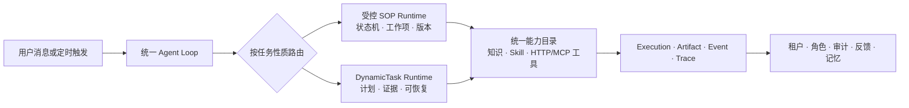

# 共格·序伴

<p align="center">
  
</p>

<p align="center">
  <strong>让企业 AI 既能按流程办事，也能把复杂任务做完</strong><br />
  面向企业流程业务与个人办公提效的数字员工构建、运行与治理平台
</p>

<p align="center">
  <strong>稳定受控 × 自由动态</strong>
</p>

<p align="center">
  
  
  
  
  
</p>

<p align="center">
  中文 · <a href="README.en.md">English</a>
</p>

<p align="center">
  <a href="backend/app/dynamic_tasks/">查看动态任务执行源码</a>
</p>

共格·序伴（Gongge Xuban）把岗位知识、SOP、审批、工具和通用 Skill 组合成可执行、可治理、可复用的组织能力。用户从对话或定时任务进入，平台根据任务性质选择合适的运行方式，并把执行过程、依据、人工介入和结果沉淀下来。

## 先记住这件事

企业里的任务并不只有一种形态：

- 有些任务步骤稳定、责任清楚、需要审批或留下业务凭据，应该由**受控 SOP**推进。
- 有些任务目标开放、需要查资料、分析文件、组合方法并形成交付物，应该由**动态任务**完成。
- 两者混合时，让 SOP 保持流程和责任主权，让 Skill、知识和动态能力承担受限的分析与执行子任务。

共格·序伴把这两种能力放进同一个 Agent Loop、同一套能力目录和执行治理边界中。它不是把所有事情交给模型临场发挥，也不是把所有事情都写死；确定性放在流程、权限和副作用边界，灵活性放在目标理解、计划、知识和方法组合。

## 两种运行模式

| 模式 | 解决什么问题 | 运行方式 | 适合的任务 |
| --- | --- | --- | --- |
| **受控 SOP** | 把稳定规则变成可执行的业务流程 | 版本化状态机推进节点，收集槽位，按条件分支；在确认、审批、人工工作项或外部事件处暂停 | 请假、报销、权限开通、盖章申请、HR 证明、IT 工单、合同审查等 |
| **动态任务** | 把开放目标变成可交付的多步工作 | 根据目标和成功标准生成有界计划，组合已授权的知识、Skill、工具、附件和交付物；缺信息、需审批或需重新授权时暂停并恢复 | 文档分析与对比、资料研究、数据整理、故障诊断、方法化写作、结果校验等 |

### 受控 SOP：流程型业务的确定性

- 以统一元模型描述节点、输入槽位、允许动作、条件和终止状态，并绑定发布时的版本。
- 支持 `collect_input`、`decision`、`service_task`、`human_task`、`terminal` 等节点语义。
- 支持显式确认、结构化工作项、候选人/组织范围、防自审，以及 `all`、`any`、`quorum` 等完成门槛。
- 执行存储记录实例、节点、操作和尝试，配合幂等键、超时、重试、租约和审计事件。
- 工具、知识和通用 Skill 可以服务流程节点，但不能绕过当前 SOP 的状态、权限或用户确认。

### 动态任务：Agent Loop 的第二条主执行线

- 从“目标 + 成功标准”出发，由服务端归一化计划、步骤依赖、预算和可用能力。
- 普通回答、知识、通用 Skill、动态规划、持久执行、恢复、附件分析、Artifact、steering 和只读工具均属于正常能力基线，不因租户/数字员工 allowlist 未配置而被整体阻断。
- 默认提供有限的步骤、模型调用、运行时间和并发预算，并继续执行租户隔离、角色权限、工具可靠性、幂等、取消和恢复约束。
- 能在澄清、人工关注、工具审批、重新授权、容量不足或外部结果待对账时持久暂停，并由信号恢复。
- 结果不是只看模型是否返回文本：验证器会检查成功标准、证据引用、交付物和 Skill 指导是否得到应用。
- `external_write` 和 `destructive` 是独立的高风险能力面：只有它们需要额外授权、可靠性契约、灰度和必要的人工确认；高风险能力未就绪时，不应影响普通只读动态任务。
- 全局动态开关（当前配置名 `DYNAMIC_TASK_EXECUTION_ENABLED`）只用于故障处置的 kill switch，正常启动基线应为开启，而不是日常发布前置条件。

### 对话页选择复杂任务引擎

对话 Composer 提供 `DynamicTaskAgent` 复杂任务引擎选项。未选中时，平台按现有自动路由处理；选中后，当前没有正在执行的 SOP 时，本轮默认进入 DynamicTaskAgent，并将引擎选择作为请求契约固化到消息和排队 Turn。若会话已有活动 SOP 游标、等待项或人工协作状态，下一条消息仍由正式 SOP Runtime 继续，避免两个运行时并行接管同一会话。SOP 结束后，后续消息重新按当前引擎选择判断。

## 一个统一的运行闭环



一次任务从理解到交付，大致经过：

1. **路由**：识别当前是回答、知识任务、通用 Skill、受控 SOP 还是需要持久执行的动态任务。
2. **装配**：只从当前租户、用户和数字员工的有效目录加载模型、知识、工具和固定 Skill 修订。
3. **执行**：推进状态机，或运行一个有预算的动态计划；必要时实时输出 SSE 事件并支持取消。
4. **等待与恢复**：把人工待办、澄清、审批、重新授权、定时器和外部事件变成可追踪的等待状态。
5. **验证与沉淀**：保存执行账本、证据、Artifact、Trace、审计和反馈，让结果可检查、可接续、可改进。

## 为什么这套组合适合企业

### 1. 数字员工是能力边界，不只是一个聊天头像

每个数字员工可以组合岗位职责、人设、模型、知识库、通用 Skill、SOP、工具、记忆和工作记录。租户、用户角色、组织范围和资源绑定共同决定“谁能让哪个员工做什么”，个人提效与组织复用使用同一套资产模型。

### 2. Skill 和专家让动态任务更有方法

平台支持以 `SKILL.md` 为核心的通用能力包，以及随正式版本交付的已审核 Agency Agents 中文内置专家和精选岗位资源。Skill 可以从本地文件、ZIP 或固定版本的 GitHub 来源进入候选、审核、发布和绑定流程；运行时固定 revision 与 checksum。Skill 提供的指导属于受审查的 guidance，不能覆盖平台安全策略、租户权限、SOP 或用户明确指令。

可运行的 Skill 由 Python/Bash runner 承载，执行受到受控运行环境、依赖/包策略、超时、路径与 shell 规则、权限和取消收敛约束。Agency Agents 内置专家来自随版本固定交付的中文资源包，运行时不跟随 GitHub 自动更新；升级由下一版发布包显式携带。

### 3. 知识回答和任务结果都尽量留下依据

受管知识库支持文档解析、知识定位、来源引用和访问治理；动态任务把证据引用、成功标准和 Artifact 纳入结果验证。这样输出不止是一段看似合理的文本，还能回答“依据是什么、完成了什么、哪里需要人确认”。

### 4. 工具能力有风险分类和副作用边界

工具能力覆盖 HTTP、MCP 和内置服务，并按 `read`、`local_write`、`execute`、`external_write`、`destructive` 等风险类别描述确认、幂等、对账、超时和并行策略。普通只读工具可以进入动态任务；外部写入和破坏性操作则需要各自的授权、灰度与可对账路径。

### 5. 等待、失败和重启是执行状态，不是聊天断点

SOP 与 DynamicTask 都把重要进展写入持久执行记录。租约、fencing token、幂等键、重试/退避、恢复 signal、死信与外部效果对账共同保护迟到 worker 和不确定结果；人工接管后也能带着上下文继续，而不是从一段聊天记录猜测下一步。

### 6. 从个人工作台到组织治理闭环

同一平台包含对话工作台、数字员工与资源管理、开放广场、工作项/关注中心、执行追踪、管理审计、定时任务、记忆和反馈。成熟的个人方法可以变成团队可发布的 Skill、SOP 或数字员工，组织仍能保留版本、授权和使用记录。

### 补充：企业微信作为员工工作入口

企业微信外部连接把平台能力带到员工已有的工作场景中：员工可以在企业微信自建应用会话里直接向绑定的数字员工发起问题或任务，消息经过回调验签、发送者映射和 Agent 路由后，进入同一条 Agent Loop。执行结果可以返回企业微信，系统内同时保留 Execution、审计和外部调用回执。

连接档案支持 CorpID、AgentId、Secret 以及回调 Token/EncodingAESKey 的验证和轮换，并按租户、连接档案和数字员工绑定限制能力。默认采用最小只读授权；`wecom.message_send` 属于单独开启、审批和外部效果对账的外部写动作。它是企业落地的重要工作入口，也是 SOP 与动态任务触达员工现有工作场景的一种方式，而不是另一套执行语义。

## 典型落点

| 场景类型 | 推荐组合 | 例子 |
| --- | --- | --- |
| 规则稳定、需要审批 | SOP + 工作项 + 业务工具 | 请假/报销/权限/盖章/证照/工单/合同风险审查 |
| 目标开放、重分析和交付 | 动态任务 + 知识 + Skill + Artifact | 多份制度对比、数据汇总、故障证据整理、研究简报、规范文档生成 |
| 既要流程又要判断 | SOP 保持主流程，Skill/知识处理子任务 | 在合同审查流程中抽取条款、归纳风险、补充证据，再进入人工决定 |

### 如何选择

| 如果你的任务…… | 优先选择 |
| --- | --- |
| 有固定步骤、明确责任人、需要审批或业务系统凭据 | **SOP** |
| 目标清楚但步骤需要现场判断，结果需要多来源证据或交付文件 | **动态任务** |
| 既有不可跳过的流程节点，又有开放式分析 | **SOP 做外壳，Skill/知识/受限动态能力做子任务** |

## 快速开始

### 环境要求

- Python 3.11+
- Node.js 20+
- npm
- 可选：Docker Compose 与 MySQL 8.4

### macOS、Linux 或 WSL

```bash
cd backend
python3.11 -m venv .venv
source .venv/bin/activate
pip install -e ".[dev]"
cp .env.example .env

cd ../frontend-enterprise
npm ci
cd ..

./app.sh dev
```

### Windows PowerShell

```powershell
cd backend
py -3.11 -m venv .venv
.\.venv\Scripts\python.exe -m pip install -e ".[dev]"
Copy-Item .env.example .env

cd ..\frontend-enterprise
npm ci
cd ..

.\app.ps1 dev
```

常用入口：

- 对话工作台：`http://localhost:5137/chat/`
- 企业管理端：`http://localhost:5137/enterprise/dashboard`
- 健康检查：`http://localhost:5137/api/health`

首次运行请先在管理端配置一个可用的 OpenAI Chat Completions 兼容模型，并按数字员工绑定知识、Skill、SOP 和工具。开发环境的演示数据会初始化管理员和精选资源；请在本地初始化后使用你自己设置的凭据，生产环境不要沿用演示账号或密钥。

后台运行与生命周期管理：

| 操作 | macOS、Linux 或 WSL | Windows PowerShell |
| --- | --- | --- |
| 前台开发 | `./app.sh dev` | `.\app.ps1 dev` |
| 后台运行 | `./app.sh` | `.\app.ps1` |
| 查看状态 | `./app.sh status` | `.\app.ps1 status` |
| 停止服务 | `./app.sh stop` | `.\app.ps1 stop` |

### 动态任务与高风险能力

普通动态能力不需要额外“开通”：它们是 Agent Loop 的正常执行路径，并使用默认的有界预算与运行保护。租户/数字员工 allowlist 只用于需要额外风险控制的能力，不应阻断普通只读动态任务。

高风险能力单独治理：

- `external_write`：经过工具可靠性契约、角色权限、明确确认/审批、幂等与外部效果对账，并按租户或数字员工灰度。
- `destructive`：按更高风险等级单独授权和灰度，遵守平台禁止/人工介入策略。
- `DYNAMIC_TASK_EXECUTION_ENABLED`：仅在故障处置时作为全局 kill switch 使用；恢复后应重新开放正常动态主线。

动态任务的配额、超时、取消、租约、恢复 signal 和审计仍然持续生效。实现入口见 [`backend/app/dynamic_tasks/`](backend/app/dynamic_tasks/) 与 [`backend/app/general_skills/`](backend/app/general_skills/)。

## 数据库与部署形态

- **SQLite**：桌面版与零配置开发的默认数据库。
- **MySQL 8.4**：服务端部署路径，使用 `utf8mb4`、UTC 和 Alembic 迁移。
- **浏览器工作台**：对话、管理、广场、工作项、审计和执行追踪共用单端口应用。
- **桌面打包**：`packaging/` 提供 macOS、Windows、Linux 的 PyInstaller 构建与冻结运行时校验链路。

配置优先级为：操作系统环境变量 → `backend/.env` → `backend/app/config.py` 默认值。MySQL 部署或拉取包含新迁移的版本后，先启动 MySQL，再执行项目提供的迁移脚本：

```bash
docker compose up -d mysql
./db.sh
```

`./db.sh` 默认执行 MySQL Alembic 迁移，`./db.sh check` 只检查版本。`./app.sh` 和 `./app.sh dev` 会在启动服务前执行不超过 10 秒的只读迁移检查。若当前版本落后于 Alembic head，启动会立即停止并打印当前版本、目标版本和 `./db.sh`，不会让 supervisor 反复拉起失败的应用；SQLite 会跳过这条 MySQL 检查并继续使用现有初始化路径。底层 Python 脚本仍支持 `--check`，在需要迁移时返回退出码 2。

不要用 `SQLModel.metadata.create_all()` 替代 MySQL 迁移，也不要使用 MySQL root 账号作为应用账号。

## 源码地图

| 目录 | 作用 |
| --- | --- |
| [`backend/app/core/agent_loop.py`](backend/app/core/agent_loop.py) | 统一对话循环、路由、SSE、取消、能力编排和结果落盘 |
| [`backend/app/sop_runtime/`](backend/app/sop_runtime/) | SOP 定义、编译、状态机、执行存储、工作项与确认 |
| [`backend/app/dynamic_tasks/`](backend/app/dynamic_tasks/) | 动态计划、能力快照、持久执行、恢复 worker 与结果验证 |
| [`backend/app/general_skills/`](backend/app/general_skills/) | Skill 导入、审核、发布、版本、资格解析与 runner |
| [`backend/app/knowledge/`](backend/app/knowledge/) | 知识库、解析、检索、概念与引用 |
| [`backend/app/connectors/`](backend/app/connectors/) | 企业微信/Slack 外部连接、回调消息、Agent 绑定与受控外发 |
| [`backend/app/observability/`](backend/app/observability/) | Trace、Span、事件和运行观测 |
| [`frontend-enterprise/`](frontend-enterprise/) | React + TypeScript 企业工作台 |
| [`packaging/`](packaging/) | 桌面构建、签名和冻结版验证 |

## 文档导航

- [Agent Loop 源码](backend/app/core/agent_loop.py)——路由、SOP、Skill、知识、工具与回复阶段
- [SOP Runtime 源码](backend/app/sop_runtime/)——状态机、版本、执行存储、工作项与确认
- [DynamicTask 源码](backend/app/dynamic_tasks/)——动态计划、持久执行、恢复与结果验证
- [General Skills 源码](backend/app/general_skills/)——Skill 导入、审核、发布、运行时与 runner
- [知识库源码](backend/app/knowledge/)——知识解析、检索、概念与引用
- [后端开发说明](backend/README.md) · [前端开发说明](frontend-enterprise/README.md)

仓库内的设计、验收材料和 `agency-agents-library/` 历史导入包属于本地/部署侧资产，按仓库策略不随 GitHub 源码发布；随产品运行的内置专家固定包位于 `backend/app/experts/data/`，由发布 spec 显式打入 EXE。公开入口以 README、源码、测试和各模块 README 为准。

## 开发检查

```bash
cd frontend-enterprise
npm run brand:check:test
npm run brand:check
npm run i18n:check
npm run test:run
npm run build

cd ../backend
.venv/bin/ruff check .
.venv/bin/pytest
```

完整浏览器回归需要先在 `frontend-enterprise/` 执行 `npm run test:e2e:install`；MySQL 集成测试未配置测试管理员连接时按预期跳过。开发检查不会替代真实模型、真实企业系统和高风险审批的联调验收。

## 诚实的边界

- 模型输出仍可能不完整或错误；知识引用、成功标准和人工确认用于降低风险，不等于自动获得业务正确性。
- 高风险审批仍需要真实审批系统、身份授权和合规策略；SOP 文本不能替代企业审批事实。
- HTTP/MCP 工具需要由部署方提供真实认证、最小权限、超时、幂等和对账能力；示例 mock 不能代表生产系统。
- 多数字员工自动协作、复杂多级会签以及部分受监管场景需要进一步的业务集成或二次开发。
- 生成代码和外部 Skill 必须经过来源、权限、依赖和运行环境审查，不能把“可运行”理解为“可无条件执行”。

## 参与开发

当前仓库以源码、测试和随附文档为准。提交修改前请阅读 [AGENTS.md](AGENTS.md)，并保留租户隔离、版本/幂等、事件/状态机和 SQLite/MySQL 双数据库边界。
